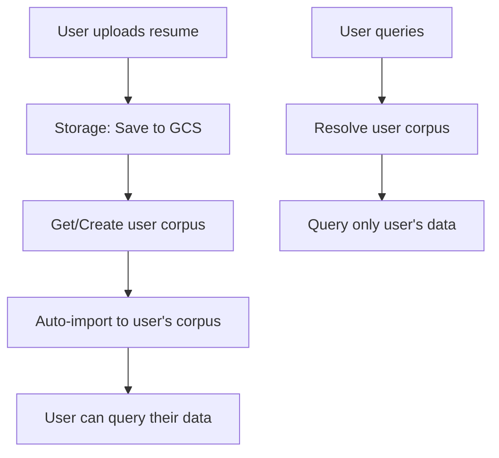

# Per-User Corpus System Guide

## Overview

Your RAG system now supports **automatic per-user corpus creation** instead of using a single shared corpus. This provides complete data isolation between users - perfect for your job hunting bot where each user's resume and data should be private.

## What Changed

### ✅ Before (Single Corpus)
- All users shared one corpus: `6838716034162098176`
- No data isolation between users
- Manual import required

### 🚀 After (Per-User Corpus)
- Each user gets their own corpus automatically
- Complete data isolation
- Automatic import when files are uploaded
- Backward compatible (can still use shared corpus if needed)

## Key Components

### 1. Corpus Manager (`VertexCorpusManager`)
**File:** `src/lib/corpus-manager.ts`

Handles corpus lifecycle:
- ✨ `createUserCorpus(userId)` - Creates new corpus for user
- 🔍 `getUserCorpus(userId)` - Gets existing or creates new corpus
- 📋 `listCorpora()` - Lists all corpora in project
- 🗑️ `deleteCorpus(corpusId)` - Deletes a corpus

### 2. Enhanced RAG Client (`VertexRAGClient`)
**File:** `src/lib/rag-client.ts`

Now automatically resolves user corpus:
- `resolveUserCorpus(userId)` - Gets user's corpus ID
- Works with both per-user and shared corpus modes
- Backward compatible with existing `ragCorpusId` config

### 3. New API Endpoints

#### Corpus Management
- `POST /api/corpus/create` - Create user corpus
- `POST|GET /api/corpus/get` - Get/create user corpus
- `GET /api/corpus/list` - List all corpora

#### Enhanced Storage Upload
- `POST /api/storage/upload` - Now automatically imports to user's corpus

## Flow Diagram



## API Usage Examples

### Upload File (Auto-Import)
```javascript
const formData = new FormData();
formData.append('file', resumeFile);
formData.append('userId', 'user123');

const response = await fetch('/api/storage/upload', {
  method: 'POST',
  body: formData
});

const result = await response.json();
// result.ragImport.success indicates if import worked
```

### Query User's Data
```javascript
const response = await fetch('/api/rag/query', {
  method: 'POST',
  headers: { 'Content-Type': 'application/json' },
  body: JSON.stringify({
    userId: 'user123',
    question: 'What programming languages do I know?'
  })
});
```

### Get User's Corpus
```javascript
const response = await fetch('/api/corpus/get', {
  method: 'POST',
  headers: { 'Content-Type': 'application/json' },
  body: JSON.stringify({ userId: 'user123' })
});

const result = await response.json();
// result.corpusId contains the user's corpus ID
// result.exists indicates if it was existing or newly created
```

## Configuration

### Environment Variables
Make sure these are set in your `.env`:
```bash
GOOGLE_CLOUD_PROJECT_ID=your-project-id
GOOGLE_CLOUD_BUCKET_NAME=your-bucket-name
```

### Backward Compatibility
To use the old shared corpus mode, just provide `ragCorpusId` in the config:
```typescript
const rag = new VertexRAGClient({
  projectId: 'your-project',
  location: 'us-east4',
  ragCorpusId: '6838716034162098176' // Uses shared corpus
});
```

Without `ragCorpusId`, it automatically creates per-user corpora.

## Testing

### Test Script
Run the test script to verify everything works:
```bash
cd /home/wagle/corpus-rag
bun run test-per-user-corpus.ts
```

### Manual Testing
1. Upload a resume for `user1`
2. Upload a resume for `user2`
3. Query both users - they should get different results
4. Check `/api/corpus/list` to see separate corpora

## Benefits for Job Hunting Bot

### 🔒 **Privacy & Security**
- Complete data isolation between users
- No cross-user data leakage
- Each user only sees their own resumes/data

### ⚡ **Performance**
- Smaller corpus per user = faster queries
- More relevant results (no noise from other users)
- Better embedding quality

### 🛠️ **Scalability**
- Add users without affecting existing ones
- Easy to delete user data (just delete their corpus)
- Per-user analytics and monitoring

### 🤖 **AI Enhancement Features**
- User-specific resume optimization
- Personalized cover letters
- Context-aware job matching
- Individual user preferences

## Next Steps

1. **Test with real users** - Upload different resumes and verify isolation
2. **Add user management** - Create user-specific dashboards
3. **Implement cleanup** - Delete old corpora when users leave
4. **Add analytics** - Track per-user usage and performance
5. **Enhanced AI features** - Use user-specific context for job applications

## Troubleshooting

### Common Issues

**Corpus creation fails:**
- Check Google Cloud permissions
- Verify Vertex AI API is enabled
- Ensure correct project ID and location

**Import fails:**
- Check cloud storage permissions
- Verify file format (PDF, DOCX, TXT supported)
- Check file size limits

**Query returns no results:**
- Wait for import to complete (it's async)
- Check import operation status
- Verify corpus has documents

### Debug Commands
```bash
# Check corpus status
curl -X GET "http://localhost:3000/api/corpus/list"

# Check user's corpus
curl -X POST "http://localhost:3000/api/corpus/get" \
  -H "Content-Type: application/json" \
  -d '{"userId": "test-user"}'
```

## Support

This system is designed to be robust and self-healing. If you encounter issues:

1. Check the browser console for errors
2. Look at server logs for detailed error messages
3. Verify Google Cloud authentication is working
4. Test with the provided test script

The system automatically handles corpus creation, so users don't need to worry about setup - just upload and query!